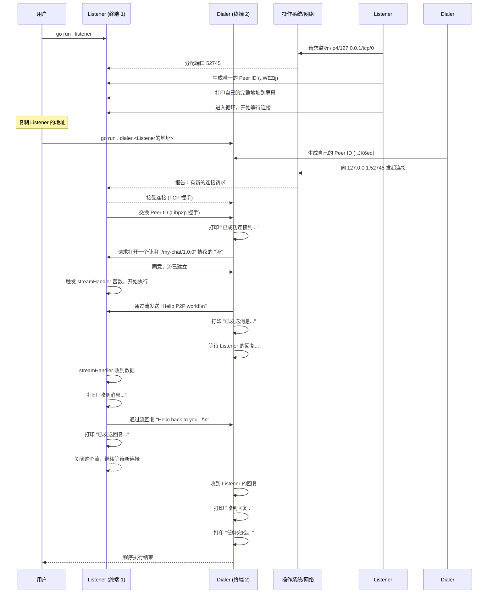

是的，**这代表您的 Go P2P 程序已经完全正确地运行了！** 恭喜，您已经成功地在两台“计算机”（由两个终端模拟）之间建立了真实的 P2P 连接，并完成了双向通信。

您的困惑很正常，因为这背后确实发生了很多事情。我们进入 **常规模式**，让我为您画一幅严格按照时间顺序的图，清晰地解释清楚刚才到底发生了什么。

### **P2P "Hello, World" 运行全景图**

这张图将展示从您敲下第一个命令到程序结束，两个角色（Listener 和 Dialer）的每一步动作和它们之间的互动。

### **分步文字详解**

让我们把上图中的每个关键时刻串起来：

1.  **启动 Listener (服务员就位)**
    *   您在 **终端1** 运行 `go run . listener`。
    *   `Listener` 程序启动，像一个餐厅开门营业。它向操作系统申请了一个地址和门牌号（`127.0.0.1:52745`），并生成了自己独一无二的身份标识 `Peer ID` (`...WEZij`)。
    *   它把完整的“地址+身份” (`.../p2p/...WEZij`) 打印出来，告诉全世界：“我在这里，我叫这个名字，想找我请来这里！”
    *   然后，它就静静地**等待**，准备接待客人。

2.  **启动 Dialer & 连接 (客人上门)**
    *   您在 **终端2** 运行 `go run . dialer <地址>`。
    *   `Dialer` 程序启动，像一个拿到了地址的客人。它也有自己的 `Peer ID` (`...JK6ed`)。
    *   它根据您给的地址，准确地找到了 `Listener` 的“大门”（`127.0.0.1:52745`），并发起连接。
    *   双方通过网络“握手”，确认了彼此的身份。`Dialer` 知道它连上的是 `...WEZij`，`Listener` 也知道了来的客人是 `...JK6ed`。

3.  **通信 (开始点餐和对话)**
    *   连接建立后，`Dialer` 主动说：“我想用 `/my-chat/1.0.0` 这个协议和你说话”（即 `host.NewStream`）。这相当于客人说：“我想点菜”。
    *   `Listener` 同意了，于是双方之间建立了一个专门的对话通道（`Stream`）。
    *   `Dialer` 通过这个通道发送了 **`"Hello P2P world!"`**。
    *   `Listener` 的 `streamHandler` 函数（专门处理对话的服务员）收到了这条消息，并打印出来。
    *   `Listener` 准备了一句回复 **`"Hello back to you...!"`**，并通过同一个通道发了回去。
    *   对话结束，`Listener` 挂断了这个通道（`stream.Close()`），但它本身还在继续等待下一个客人。

4.  **结束 (客人离开)**
    *   `Dialer` 收到了 `Listener` 的回复并打印。
    *   它的任务（发起连接、发送消息、接收回复）已经全部完成，于是程序正常退出。

**核心总结：**

*   **Listener** 是一个**长期运行**的服务，它启动后就一直**被动等待**。
*   **Dialer** 是一个**一次性**的客户端，它**主动发起**连接，完成一套指定动作后就结束。
*   `libp2p` 库帮我们处理了所有复杂的底层网络细节（TCP握手、端口管理、加密、身份验证），让我们只需要专注于定义“连接上之后做什么”（`streamHandler`）这个核心业务逻辑。

希望这幅图和解释能让您对整个流程有更清晰、更直观的理解！